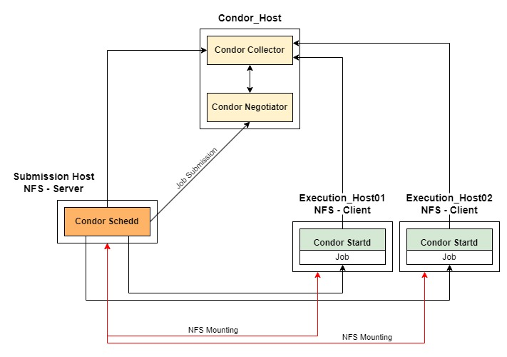
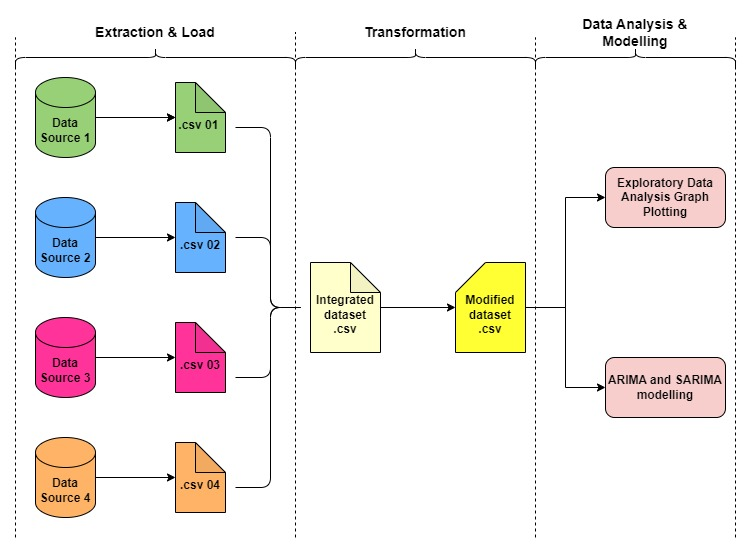

# Implementation of Parallel and Distributed Compunting in Data Processing Works with HTCondor.
## Table of Contents
1. [Distributed Architecture Framework](#distributed-architecture-framework)
2. [Project Data processing Workflow](#project-data-processing-workflow)
3. [Setup Process](#setup-process)
    - [Setting Up Amazon Web Services EC2 Instances](#setting-up-amazon-web-services-ec2-instances)
    - [Setting Up HTCondor Cluster](#setting-up-htcondor-cluster)
    - [Setting Up Network File System (NFS)](#setting-up-network-file-system-nfs)
        - [Setting up NFS Server on Submission Host](#setting-up-nfs-server-on-submission-host)
        - [Setting up NFS Client on Execution Host](#setting-up-nfs-client-on-execution-host)
4. [Common Issues Faced](#common-issues-faced)
## Distributed Architecture Framework
<div>
    
</div>
A brief introduction on the distributed architecture framework adopted:

- The project adopts a distributed architecture framework using HT Condor for handling distributed computing resources collaboratively.
- NFS (Network File System) is employed to provide shared storage between Execution Hosts and the Submission Host, enabling seamless file access across networks.
- Key components of the HTCondor system include::
    - **condor_collector**: Acts as a central hub for collecting and disseminating status information of execution hosts, facilitating communication within the pool.
    - **condor_negotiator**: Uses information from the Collector to match submitted jobs with available resources, optimizing computing resource utilization.
    - **condor_schedd** (Submission Host): Receives user-submitted jobs, advertises them to the Collector, and negotiates with the Negotiator to find suitable execution hosts based on job requirements and resource availability.
    - **condor_startd** (Execution Host): Coordinates the execution process of jobs assigned by Condor Schedd, contributing to the processing of these jobs.
- The framework ensures the Submission Host functions as the NFS server and the Execution Hosts as NFS clients, facilitating access to Python scripts and storage of results without the need to transfer files when submitting jobs through HTCondor.

## Project Data Processing Workflow
<div>
    
</div>
A brief introduction on the data processing workflow:

- The data processing workflow in this project focuses on Exploratory Data Analysis and developing statistical models to predict Malaysia's total export value.
- It consists of a total of three (3) phases - **Extraction and Loading**, **Data Transformation**, and **Data Analysis and Modelling**.
- The workflow aims to derive valueable insights and create predictive models to support decision-making, with a detailed explanation and sample outputs provided for the data processing in a distributed environment.

## Setup Process
The following sections describe the setup process for replicating this project works.

### Setting Up Amazon Web Services EC2 Instances.
1. Spin up a total of four (4) EC2 Instances with the configurations stated below:
    - Instance 1:
        - Name: *CondorHost*
        - Instance Type: t2.micro
    - Instance 2:
        - Name: *SubmHost*
        - Instance Type: t2.medium
    - Instance 3:
        - Name: *Executor01*
        - Instance Type: t2.medium
    - Instance 4:
        - Name: *Executor02*
        - Instance Type: t2.medium
    
    ***Notes**: All EC2 instances are using   **Amazon Linux 2023 AMI**, and group under the same security group. A new key pair or existing key pair can be used to securely connect to the launched instances.*

2. Configure the inbound rules for the selected security group to allow all traffic to pass within the security pool group.
    - Navigate to the AWS EC2 sidebar, and select the **Security Groups** from the drop down list of **Network & Security**.
    - Select the used seciurity group name and edit the inbound rules.
    - Choose **All traffic** for **Type**, **Custom** for **Source**, and select the security group name in the box next to **Source**.
    - Save the configuration.

### Setting Up HTCondor Cluster
1. Access the EC2 instances and perform updates.
    - Connect to the instances via SSH client.
    - Perform update on all instances using `sudo apt-get update`.

2. Assigning HTCondor roles to each machines. In this  project, *CondorHost* is the **Central Manager** whereas *SubmHost* is the **Submission Host**. The remaining two instances - *Executor01* and *Executor02* are the **Execution Hosts**.
    - To assign the **Central Manager**, run the following command line (Reference from this [guide](https://htcondor.readthedocs.io/en/latest/getting-htcondor/admin-quick-start.html#assigning-roles-to-machines)):

        - ```curl -fsSL https://get.htcondor.org|sudo GET_HTCONDOR_PASSWORD="$htcondor_password" /bin/bash -s -- --no-dry-run --central-manager $central_manager_name```
    - To assign the **Submission Host**, run the following command line:

        - ```curl -fsSL https://get.htcondor.org | sudo GET_HTCONDOR_PASSWORD="$htcondor_password" /bin/bash -s -- --no-dry-run --submit $central_manager_name```
    - To assign the **Execution Host**, run the following command line:

        - ```curl -fsSL https://get.htcondor.org | sudo GET_HTCONDOR_PASSWORD="$htcondor_password" /bin/bash -s -- --no-dry-run --execute $central_manager_name```
3. After installing/assigning the roles for each instance, run the following codes to check if the HTCondor is functioning properly:
    - Run
    ```sudo systemctl status condor``` command line to verify the presence of specific components within the CGroup, as per the role of the instance:
        - **condor_collector** and **condor_negotiator** need to be found on **Central Manager**.
        - **condor_schedd** needs to be found on the **Submission Host**.
        - **condor_startd** needs to be found on the **Execution Host**.
    - If any of these components are missing according to the respective roles, run the following commands to restart the HTCondor:
        - ```sudo systemctl enable condor```
        - ```sudo systemctl restart condor```
        - ```sudo systemctl status condor```

    - Run the command ```condor_status``` to verify the detection of all Execution Hosts within the HTCondor cluster. If any Execution Hosts are found missing, check that all instances are configured with the same security group and confirm that they are correctly linked with the correct Central Manager IP address during the roles assigning phase.
        
    *Notes: If the above approach does not rectify the issue with missing components, consider exploring alternative troubleshooting techniques*
    
### Setting Up Network File System (NFS)
NFS is used to allow the system to share the directoris and files with others over a network. In this setup, the Submission Host functions as the NFS Server, while the Execution Hosts act as the Clients.

The setup procedures are as below (Reference from this [guide](https://ubuntu.com/server/docs/service-nfs)):

#### Setting up NFS Server on Submission Host

1. On the **Submission Host**, run the following commands to install the NFS Server on it.
    - ```sudo apt install nfs-kernel-server```
    - ```sudo systemctl start nfs-kernel-server.service```

2. On the **Submission Host**, create two new directories - **results** and **scripts** by running this command `mkdir /results /scripts `.

3. Run this command `nano /etc/exports` to modify the file and add in the following lines at the bottom of the file:

    ```
    /home/ubuntu/scripts *(rw,sync,no_subtree_check)
    /home/ubuntu/results *(rw,sync,no_subtree_check)
    ```
4. Run this command `sudo exportfs -a` to apply the new configuration.

#### Setting up NFS Client on Execution Host

1. On the **Execution Host**, run the following commands to install the NFS Client on it.
    - `sudo apt install nfs-common`
    - `sudo systemctl start nfs-common.service`

2. On the **Execution Host**, create two new directories - **results** and **scripts** by running this command `mkdir /results /scripts `.

3. <a id="mounting"></a> Mount the created directories with the selected directories from the NFS-Server by runnning the following commands:
    - `sudo mount $Submission_Host_IP_Address:/home/ubuntu/results /home/ubuntu/results`

    - `sudo mount $Submission_Host_IP_Address:/home/ubuntu/scripts /home/ubuntu/scripts`

    ***Notes**: Replace $Submission_Host_IP_Address with the actual IP address of your submission host. To verify the NFS setup between the Server and Client, attempt to create a new file within the directories that are mounted.*

## How to Perform the Data Processing Works?
After successfully setup the AWS EC2 instances, HTCondor Cluster and NFS, follow the steps in this section to perform the data processing works.

### Descriptions on the File Directories at Submission Host
In addition to the previous created directories - results and scripts, create another two directories - **output** and **job_submission** on the **Submission Host** by running this command `mkdir /output /job_submission`.

The descriptions of each directory are as below:
- **results**: Stores the data or outputs generated from the executed jobs which include .xlsx files and images.
- **scripts**: Stores the necessary python scripts to be used for data processing works.
- **output**: Stores the error log, output log and other log files generated from submitted jobs. It helps to provide necessary information and insights for debugging and monitor the job execution process.
- **job_submission**: Stores the bash scripts and job submission files.

***Notes**: Execution Hosts only need to mount to the **results** and **scripts** directories.*

### Setting Up the Virtual Environment on Execution Hosts
On the **Submission Host**, perform the following steps:
1. Create a **.py** file in the **scripts** folder (Refer [this](scripts/venv_setup.py)).
2. Create a bash script **.sh** file in the **job_submission** folder (Refer [this](job_submission/venv_setup.sh)).
3. Create a job submission file **.sub** in the **job_submission** folder (Refer [this](job_submission/venv_setup.sub)).
4. Test run it by submitting a job by running this command `condor_submit job_submission/venv_setup.sub`.
5. Check the error logs and output logs in the **output** folder.

### Submitting Jobs to Execute Data Processing Works.
After setting up the virtual environment, perform the following steps to start the data processing works:
1. In the **scripts** folder, create all the required python files as shown [here](scripts/). Within the same folder, create a **.env** to store the environment variables such as:
    - csrf_token 
    - cookies
    - FRED_API

    ***Notes**: Refer to [export.py](scripts/export.py), [import.py](scripts/import.py) and [fred.py](scripts/fred.py) to understand the usage of each environment variables.

2. In the **job_submission** folder, create all the required bash scripts (**.sh**) and job submission files (**sub**) as shown [here](job_submission/).
    - The explanations on the components in the **.sh** file are as below:
        - By taking [export.sh](job_submission/export_data.sh) as an example,
            ```
            #!/bin/bash
            chmod +x venv_setup.sh
            ./venv_setup.sh
            
            cd /home/ubuntu/
            source /home/ubuntu/venv/bin/activate
            
            time python3 /home/ubuntu/scripts/export.py
            deactivate
            ```
        
        - `chmod +x venv_setup.sh` is used to change the **venv_setup.sh** file to be executable.
        - `./venv_setup.sh` is used to run the **venv_setup.sh** file.
        - `source /home/ubuntu/venv/bin/activate` to activate the virtual environment.
        - `time python3 /home/ubuntu/scripts/export.py` is used to record the time taken to execute the **export.py** script.
        - `deactivate` to deactivate from the virtual environment.

    - The explanations on the components in the **.sub** file are as below:
        - **executable**: The file to be executed
        - **output**: To save the outputs generated from the execution of the file to a specific path.
        - **error**: To save the errors generated from the execution of the file to a specific path.
        - **log**: To save the logs generated from the execution of the file to a specific path.
        - **should_transfer_file**: To enable the transfer of files
        - **when_to_transfer_output**: To set when the outputs will be transferred
        - **transfer_input_files**:: To specify other files need to be transferred to the Execution Host.
        - **request_cpus**: To request the number of CPU to execute the job.
        - **request_memory**:To request the amount of memory to execute the job.
        - **request_disk**:To request the amount of disk space to execute the job.
        - **queue**: To wait for available resources.


3. In the **job_submission** folder, create a **.dag** file as shown [here](job_submission/run.dag). The **.dag** file is used as a Workflow Management Engine.
4. Submit the dag file by running this command `condor_submit_dag .dag`. Replace the .dag with your own dag file name.
5. All the results generated will be stored in the **results** folder.

## Common Issues Faced:
### Issue 1: NFS Clients demount from NFS Server when AWS EC2 instances restarted.
When AWS EC2 instances are rebooted, NFS Clients may become disconnected from the NFS Server. An indicator of this problem is the error logs from submitted jobs, stating that specific files are not found from the specified directory.

**Solution**: This issue can be resolved by remounting the directories from NFS Clients to the NFS Server. For more details see [Step 3 in Setting up NFS Client on Execution Host](#mounting).

#### Issue 2: NFS Client could not be started due to masked.
**Solution**: Refer to this two references - [Reference A](https://unix.stackexchange.com/questions/308904/systemd-how-to-unmask-a-service-whose-unit-file-is-empty) and [Reference B](https://www.suse.com/support/kb/doc/?id=000019136).

